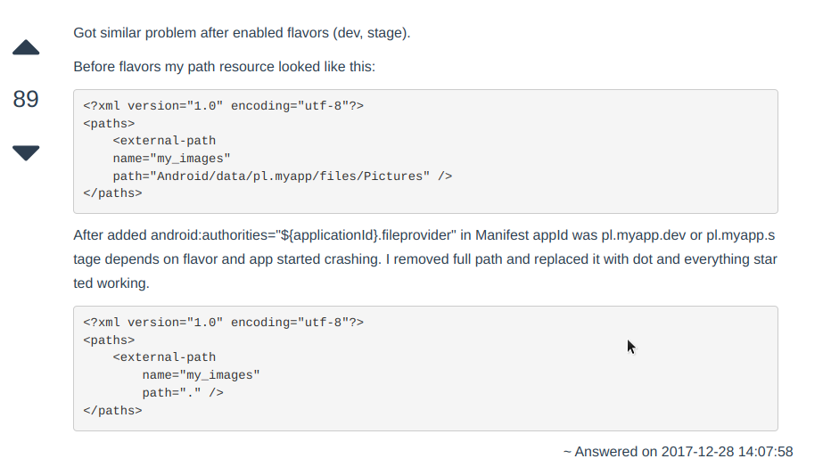
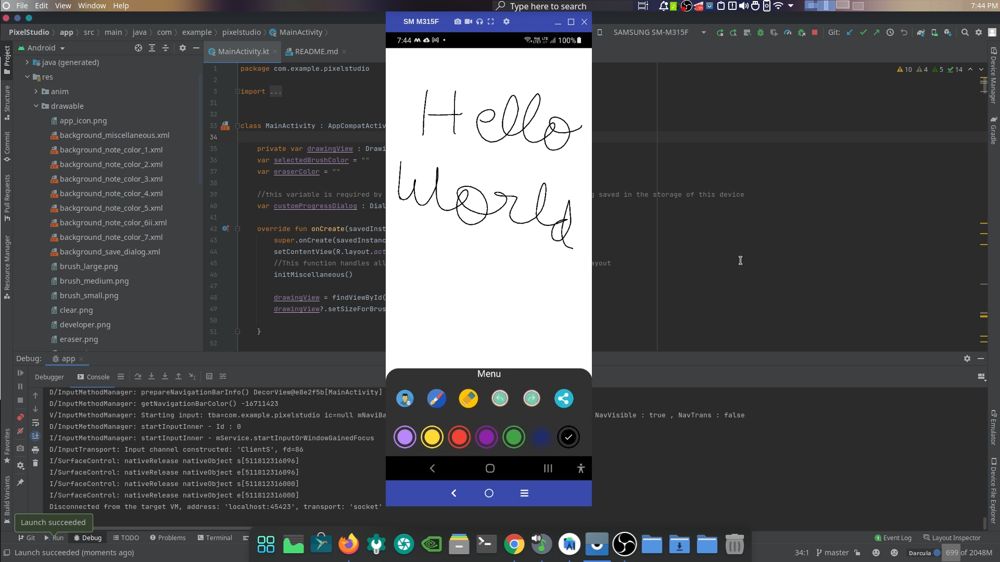

NOTE:-> 
I had a problem while trying to share the drawn image in the application via email, whatsapp, telegram etc
This is how I solved it ->
In xml path file
```
<?xml version="1.0" encoding="utf-8"?>
<paths xmlns:android="http://schemas.android.com/apk/res/android">

<!--    In here you the path where the saved images are stored will be defined-->
    <external-cache-path
        name = "my_images"
        path = "."/>

</paths>
```

In manifest file ->
```
        <provider
            android:name="androidx.core.content.FileProvider"
            android:authorities="com.example.pixelstudio.fileprovider"
            android:exported="false"
            android:grantUriPermissions="true">
            <meta-data
                android:name="android.support.FILE_PROVIDER_PATHS"
                android:resource="@xml/path" />
        </provider>
```
In my Activity file where I wanted to share the image->
```        // offer to share content
        MediaScannerConnection.scanFile(
            applicationContext,
            arrayOf(result),
            null
        ) { paths, uri ->

            // Use the FileProvider to get a content URI
            val requestFile = File(externalCacheDir?.absoluteFile.toString() + File.separator ,paths)
            val fileUri: Uri? = try {
                FileProvider.getUriForFile(
                    applicationContext, "com.example.pixelstudio.fileprovider",
                    requestFile)
            } catch (e: IllegalArgumentException) {
                Log.e("File Selector",
                    "The selected file can't be shared: $requestFile")
                null
            }


            val shareIntent = Intent()
            shareIntent.action = Intent.ACTION_SEND
            shareIntent.type = "image/png"
            shareIntent.putExtra(Intent.EXTRA_STREAM, fileUri)

            startActivity(
                Intent.createChooser(
                    shareIntent, "Share"
                )
            )
        }
```

The problem was here ->
```In path xml file
<external-cache-path
name = "my_images"
        path = "."/>
```
since we are using external-cache-path tag in path.xml we have to use "externalCacheDir?.absoluteFile.toString() + File.separator" in the code below
so that it can accurately target the saved file from the device's storage
```
val requestFile = File(externalCacheDir?.absoluteFile.toString() + File.separator ,paths) //is the correct one
```
I honestly don't know what is the cause of this issue but this gentleman in this forum says so

Here is the link to the post ->
https://syntaxfix.com/question/1595/fileprovider-illegalargumentexception-failed-to-find-configured-root

Finally this app is complete ->
This is a Drawing application which allows the user to draw on a canvas and then share his drawing using social media 

Here are some Previews of this Application->




